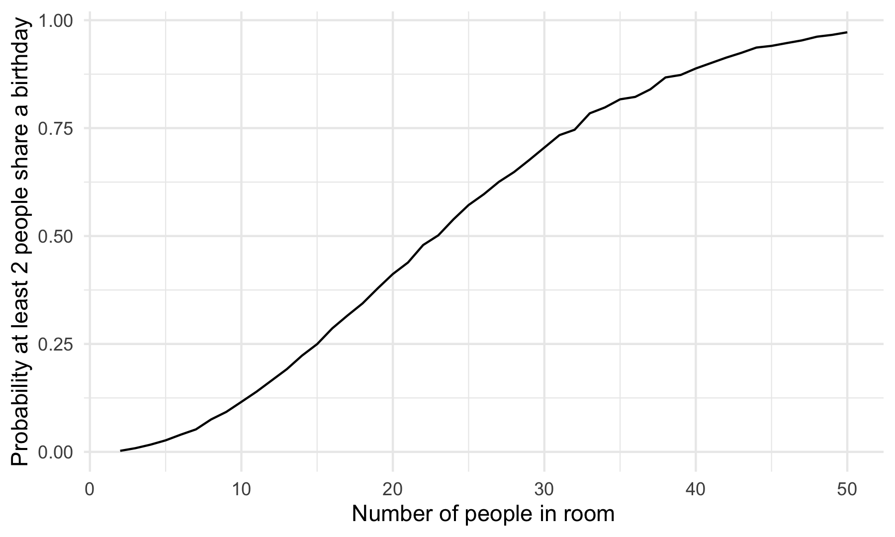

P8105 - HW5
================
Ravi Brenner

# Introduction

# Methods

# Problems

## Problem 1

The birthday problem: suppose there are n people in a room. What is the
probability that at least two people share the same birthday? We can
solve this mathematically, but here we will do so with a relatively
simple simulation.

First, a function to simulate a room of `n` people, with equally
distributed birthdays over 365 days.

``` r
bday_sim <- function(n) {
  bdays <- sample(1:365, size = n, replace = TRUE)

  duplicate <- length(unique(bdays)) < n

  return(duplicate)
}
```

Next, we can run this function 10,000 times for group sizes between 2
and 50:

``` r
sim_res <-
  expand_grid(n = 2:50,
              iter = 1:10000) |>
  mutate(res = map_lgl(n, bday_sim)) |>
  group_by(n) |>
  summarize(prob = mean(res))
```

Looking at the results:

``` r
sim_res |>
  ggplot(aes(x = n, y = prob)) +
  geom_line() +
  labs(x = "Number of people in room",
       y = "Probability at least 2 people share a birthday")
```



The probability crosses 50% around 23 people, and reaches \>95% at 50
people.

## Problem 2

This problem will use simulation to explore power in a one-sample
t-test.

First, we will write a brief function to draw values from a normal
distribution with $n = 30$, $\sigma = 5$, $\mu = 0$, and then calculate
the mean of that distribution $\hat{\mu}$. We will also perform a t-test
on that sample of 30 data points, with the null hypothesis $\mu = 0$ and
$\alpha = 0.05$.

``` r
norm_samp <- function(mu, n = 30, sigma = 5){
  sim_data <- tibble(
    x = rnorm(n = n, mean = mu, sd = sigma)
    )
  
  t_test_results <- broom::tidy(t.test(sim_data, mu = 0, conf.level = 0.95))
  
  sim_data |>
    summarize(mu_hat = mean(x),
              ) |>
    mutate(p_val = t_test_results$p.value)
}

norm_samp(mu = 0)
```

    ## # A tibble: 1 × 2
    ##   mu_hat  p_val
    ##    <dbl>  <dbl>
    ## 1  -1.62 0.0545

Now we can generate 5000 datasets from this model with $\mu = 0$, and
save the results.

``` r
sim_results_df <- 
  tibble(iter = 1:5000,
         mu = 0) |>
  mutate(results = map(mu, norm_samp)) |>
  unnest(results)
```

We can further extend this to values of $\mu$ from 1 to 6:

``` r
sim_results_df <-
  expand_grid(iter = 1:5000, 
              mu = 0:6) |>
  mutate(results = map(mu, norm_samp)) |>
  unnest(results)
```

Repeat the above for 𝜇={1,2,3,4,5,6} , and complete the following:

Make a plot showing the proportion of times the null was rejected (the
power of the test) on the y axis and the true value of 𝜇 on the x axis.
Describe the association between effect size and power. Make a plot
showing the average estimate of 𝜇̂ on the y axis and the true value of 𝜇
on the x axis. Make a second plot (or overlay on the first) the average
estimate of 𝜇̂ only in samples for which the null was rejected on the y
axis and the true value of 𝜇 on the x axis. Is the sample average of 𝜇̂
across tests for which the null is rejected approximately equal to the
true value of 𝜇 ? Why or why not?

## Problem 3

# Conclusion
