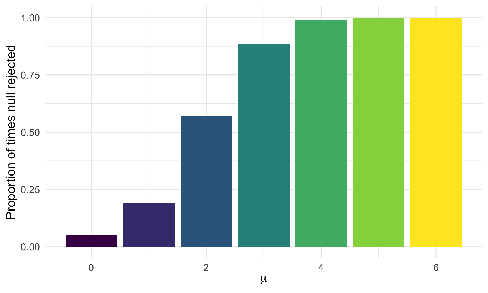
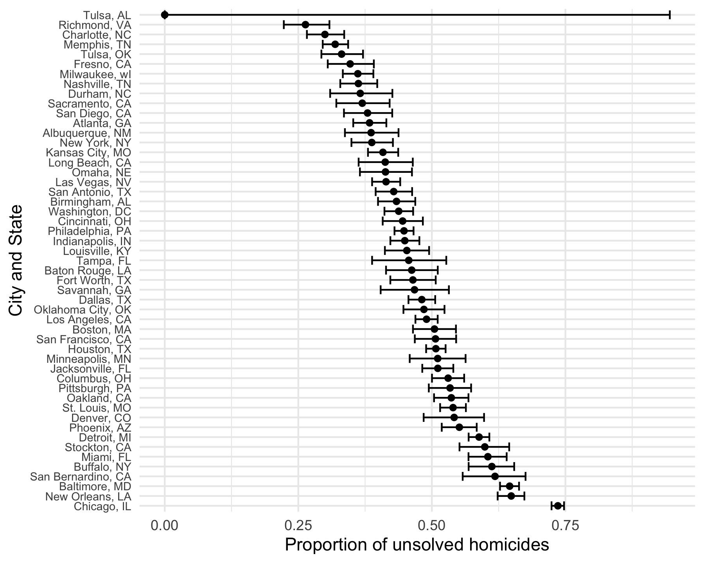

P8105 - HW5
================
Ravi Brenner

# Introduction

This homework assignment will cover a few different ways to iterate
through variables to write more efficient data analysis pipelines in R.

# Methods

The data for this problem are created via simulation, and from a dataset
available [here](https://github.com/washingtonpost/data-homicides).

NEED TO DO \* Improve write up for all 3 problems \* Silence display of
warnings in knit document \* work on viz on problem 2 \* fix output of
viz in problem 3 \* Go through HW webpage, ensure we have met all
requirements correctly

# Problems

## Problem 1

The birthday problem: suppose there are n people in a room. What is the
probability that at least two people share the same birthday? We can
solve this mathematically, but here we will do so with a relatively
simple simulation.

First, a function to simulate a room of `n` people, with equally
distributed birthdays over 365 days.

``` r
bday_sim <- function(n) {
  bdays <- sample(1:365, size = n, replace = TRUE)

  duplicate <- length(unique(bdays)) < n

  return(duplicate)
}
```

Next, we can run this function 10,000 times for group sizes between 2
and 50:

``` r
sim_res <-
  expand_grid(n = 2:50,
              iter = 1:10000) |>
  mutate(res = map_lgl(n, bday_sim)) |>
  group_by(n) |>
  summarize(prob = mean(res))
```

Looking at the results:

``` r
sim_res |>
  ggplot(aes(x = n, y = prob)) +
  geom_line() +
  labs(x = "Number of people in room",
       y = "Probability at least 2 people share a birthday")
```


The probability crosses 50% around 23 people, and reaches \>95% at 50
people.

## Problem 2

This problem will use simulation to explore power in a one-sample
t-test.

First, we will write a brief function to draw values from a normal
distribution with $n = 30$, $\sigma = 5$, $\mu = 0$, and then calculate
the mean of that distribution $\hat{\mu}$. We will also perform a t-test
on that sample of 30 data points, with the null hypothesis $\mu = 0$ and
$\alpha = 0.05$.

``` r
norm_samp <- function(mu, n = 30, sigma = 5){
  sim_data <- tibble(
    x = rnorm(n = n, mean = mu, sd = sigma)
    )
  
  t_test_results <- broom::tidy(t.test(sim_data, mu = 0, conf.level = 0.95))
  
  sim_data |>
    summarize(mu_hat = t_test_results |> pull(estimate),
              p_val = t_test_results |> pull(p.value))
}

norm_samp(mu = 0)
```

    ## # A tibble: 1 × 2
    ##   mu_hat  p_val
    ##    <dbl>  <dbl>
    ## 1  -1.62 0.0545

Now we can generate 5000 datasets from this model with $\mu = 0$, and
save the results.

``` r
sim_results_df <- 
  tibble(iter = 1:500,
         mu = 0) |>
  mutate(results = map(mu, norm_samp)) |>
  unnest(results)
```

We can further extend this to values of $\mu$ from 1 to 6:

``` r
sim_results_df <-
  expand_grid(iter = 1:500, 
              mu = 0:6) |>
  mutate(results = map(mu, norm_samp)) |>
  unnest(results)
```

Now, we can look at the proportion of times the null was rejected
(i.e. the power of the test) vs. the value of $\mu$:

``` r
sim_results_df |>
  group_by(mu) |>
  summarize(iter = n(),
            rejected = sum(if_else(p_val < 0.05,TRUE,FALSE))) |>
  mutate(prob_reject = rejected / iter) |>
  ggplot(aes(x = mu, y = prob_reject, fill = mu)) +
  geom_bar(position = "dodge",stat = "identity") +
  labs(x = expression(mu),
       y = "Proportion of times null rejected") +
  theme(legend.position = "none")
```



Make a plot showing the average estimate of 𝜇̂ on the y axis and the true
value of 𝜇 on the x axis. Make a second plot (or overlay on the first)
the average estimate of 𝜇̂ only in samples for which the null was
rejected on the y axis and the true value of 𝜇 on the x axis. Is the
sample average of 𝜇̂ across tests for which the null is rejected
approximately equal to the true value of 𝜇 ? Why or why not?

We can also look at the average estimate of $\hat{\mu}$:

``` r
all_sim_plot <- sim_results_df |>
  group_by(mu) |>
  summarize(avg_mu_hat = mean(mu_hat)) |>
  ggplot(aes(x = mu, y = avg_mu_hat)) + 
  geom_point() +
  labs(x = "True mu value",
       y = "Average mu value from simluation",
       title = "All simulations")

rej_sim_plot <- sim_results_df |>
  mutate(rejected = if_else(p_val < 0.05, TRUE, FALSE)) |>
  group_by(mu, rejected) |>
  summarize(avg_mu_hat = mean(mu_hat)) |>
  filter(rejected == TRUE) |>
  ggplot(aes(x = mu, y = avg_mu_hat)) + 
  geom_point(color = "red") +
  labs(x = "True mu value",
       y = "Average mu value from simluation",
       title = "Simulations where null was rejected")
```

    ## `summarise()` has grouped output by 'mu'. You can override using the `.groups`
    ## argument.

``` r
all_sim_plot + rej_sim_plot
```


## Problem 3

This problem uses data fram a Washington Post GitHub repo, which can be
found [here](https://github.com/washingtonpost/data-homicides).

The Washington Post has gathered data on homicides in 50 large U.S.
cities and made the data available through a GitHub repository here. You
can read their accompanying article here.

First we will import the data.

``` r
homicide_df <- read_csv("data/homicide-data.csv") 
```

    ## Rows: 52179 Columns: 12
    ## ── Column specification ────────────────────────────────────────────────────────
    ## Delimiter: ","
    ## chr (9): uid, victim_last, victim_first, victim_race, victim_age, victim_sex...
    ## dbl (3): reported_date, lat, lon
    ## 
    ## ℹ Use `spec()` to retrieve the full column specification for this data.
    ## ℹ Specify the column types or set `show_col_types = FALSE` to quiet this message.

Inspecting the data, it looks like the analysts who created it already
had it in a clean and tidy format. There are 52179 rows and 12 columns.
There are columns for report date, the victim’s name and demographic
information, the city, state, latitude/longitude, and the disposition
(i.e. the outcome of the investigation into the homicide).

Now, we can manipulate the data to learn more about the unsolved
homicides. I will create a `city_state` variable, then summarize along
that variable to get total homicides and total unsolves homicides (those
with disposition “Closed without arrest” or “Open/No arrest”).

``` r
city_df <- homicide_df |>
  mutate(city_state = str_c(city,", ", state),
         unsolved = if_else(disposition == "Closed by arrest", FALSE, TRUE)) |>
  group_by(city_state) |>
  summarize(total_homicides = n(),
            total_unsolved = sum(unsolved))
```

Looking at one city, Baltimore, MD, I can use `prop.test` to estimate
the proportion that are unsolved

``` r
baltimore_prop <- city_df |>
  filter(city_state == "Baltimore, MD") |>
  mutate(result = map2(total_unsolved, total_homicides, \(x,y) prop.test(x,y)))

baltimore_prop |>
  mutate(result_tbl = map(result, broom::tidy)) |>
  unnest(result_tbl) |>
  select(city_state, total_homicides, total_unsolved, 
         estimate, conf.low, conf.high)
```

    ## # A tibble: 1 × 6
    ##   city_state    total_homicides total_unsolved estimate conf.low conf.high
    ##   <chr>                   <int>          <int>    <dbl>    <dbl>     <dbl>
    ## 1 Baltimore, MD            2827           1825    0.646    0.628     0.663

We can turn this into one continuous pipeline, and apply it to each city
in the dataframe:

``` r
city_estimates <- city_df |>
  mutate(result = map2(total_unsolved, total_homicides, \(x,y) prop.test(x,y))) |>
  mutate(result_tbl = map(result, broom::tidy)) |>
  unnest(result_tbl) |>
  select(city_state, total_homicides, total_unsolved, 
         estimate, conf.low, conf.high)
```

    ## Warning: There was 1 warning in `mutate()`.
    ## ℹ In argument: `result = map2(...)`.
    ## Caused by warning in `prop.test()`:
    ## ! Chi-squared approximation may be incorrect

``` r
head(city_estimates)
```

    ## # A tibble: 6 × 6
    ##   city_state      total_homicides total_unsolved estimate conf.low conf.high
    ##   <chr>                     <int>          <int>    <dbl>    <dbl>     <dbl>
    ## 1 Albuquerque, NM             378            146    0.386    0.337     0.438
    ## 2 Atlanta, GA                 973            373    0.383    0.353     0.415
    ## 3 Baltimore, MD              2827           1825    0.646    0.628     0.663
    ## 4 Baton Rouge, LA             424            196    0.462    0.414     0.511
    ## 5 Birmingham, AL              800            347    0.434    0.399     0.469
    ## 6 Boston, MA                  614            310    0.505    0.465     0.545

Now for each city, we can see the estimated proportion and 95%
confidence interval for of unsolved homicides.

We can visualize this data in a plot:

``` r
city_estimates |>
  mutate(city_state = fct_infreq(city_state, w = estimate)) |>
  ggplot(aes(y = city_state, x = estimate)) + 
  geom_point() + 
  geom_errorbar(aes(xmin = conf.low, xmax = conf.high)) +
  labs(x = "Proportion of unsolved homicides",
       y = "City and State")
```



With the exception of Tulsa, AL (which has just one homicide in this
dataset), the confidence bands are relatively narrow, and cities range
in proportion of unsolved homicides from about 25% to 75%

# Conclusion

This homework showcased several ways to use `map` functions to loop
through many columns of a dataset easily in only a few lines of code.
